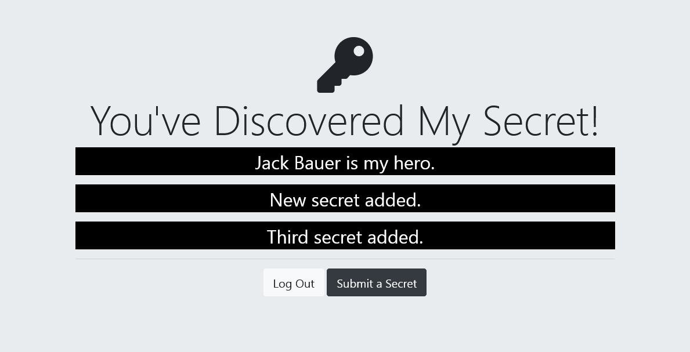

# Secrets

A simple application that people sharing secrets.

## Table of contents

- [Overview](#overview)
  - [Built with](#built-with)
  - [Installation and Setup Instructions](#installation-and-setup-instructions)
  - [Installation](#installation)
  - [To visit page](#to-visit-page)
- [Screenshots](#screenshots)

## Overview

### Built with
Used npm modules:

* body-parser
* dotenv
* ejs
* express
* express-session
* mongoose
* mongoose-findorcreate
* passport
* passport-google-oauth20
* passport-local
* passport-local-mongoose

### Installation and Setup Instructions

Clone down this repository. You will need `node` and `npm` installed on your machine.  

### Installation

```bash
git clone git@github.com:amirpoint/secrets.git --depth 1
mv secrets my-project
cd my-project
npm i
node app.js
```

### To visit page

Home<br>
`localhost:3000/`<br><br>
Sign up<br>
`localhost:3000/register`<br><br>
Login<br>
`localhost:3000/login`<br><br>
Secrets (required authenticate)<br>
`localhost:3000/secrets`<br><br>
Submit (required authenticate)<br>
`localhost:3000/submit`<br>


## Screenshots





